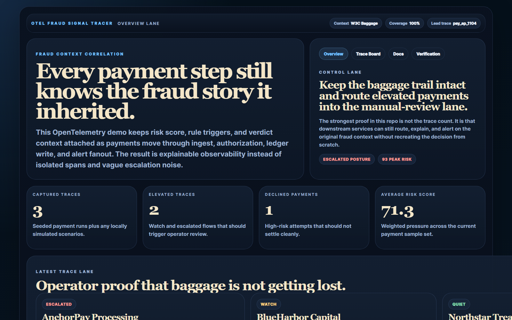
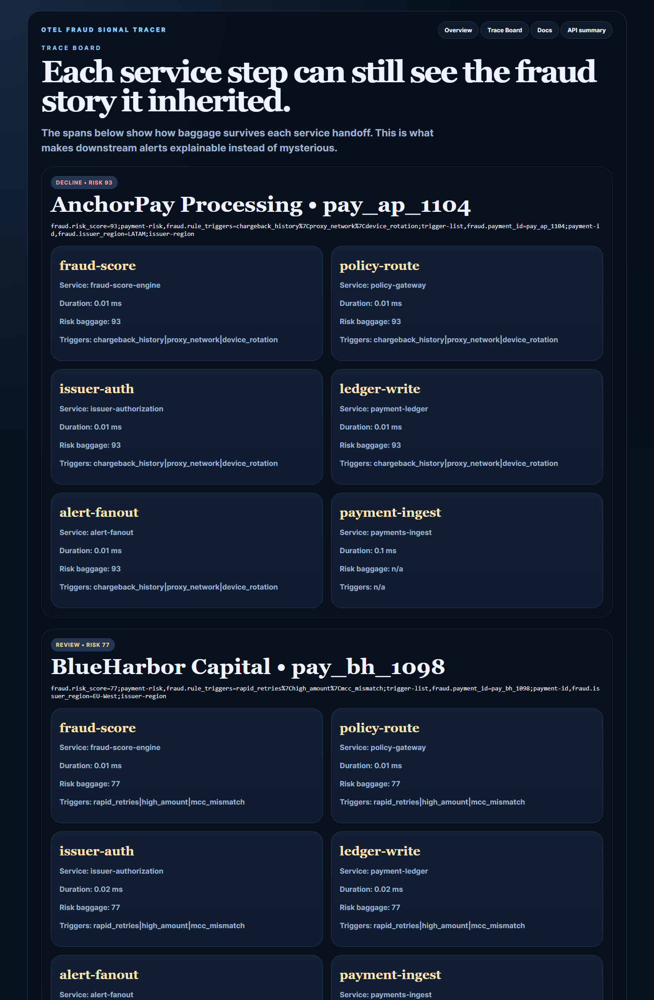
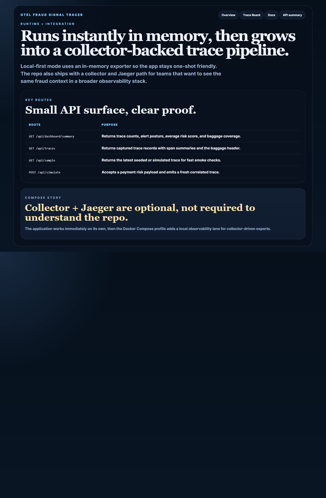
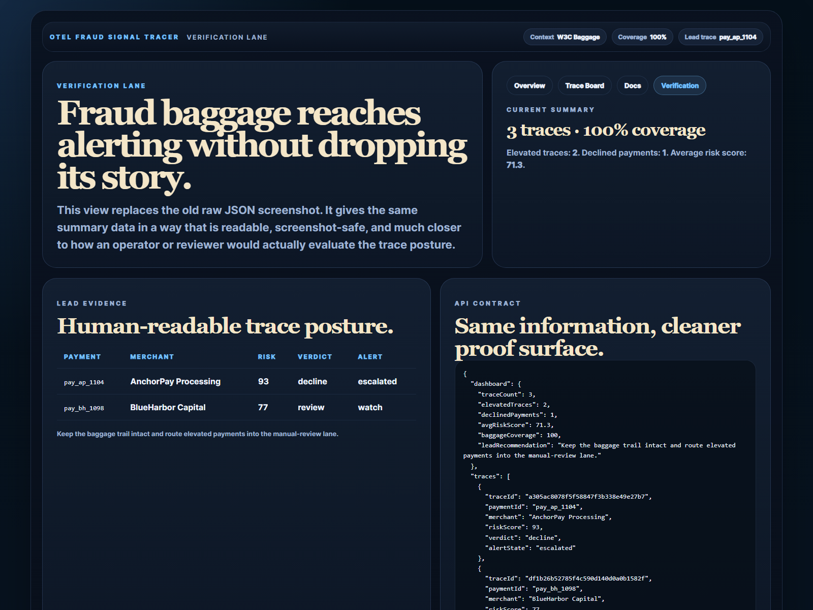

# OTel Fraud Signal Tracer

OpenTelemetry demo for **fraud-scoring baggage propagation** across payment services and trace-to-alert correlation.

> **What this repo proves**
>
> Observability becomes much more valuable when risk context survives service boundaries and still makes sense to the operator reading the trace.

## Why this repo is good

- It turns observability into a business story, not just telemetry plumbing.
- It shows how fraud context can survive service boundaries through W3C Baggage.
- It pairs cleanly with `payment-event-ledger-eos` and `pulumi-pci-dss-baseline`.
- It gives you a credible OpenTelemetry artifact with both API and local observability-stack angles.

## Screenshots






## What it does

- seeds payment fraud scenarios
- creates spans for ingest, fraud score, policy route, issuer auth, ledger write, and alert fanout
- propagates fraud risk score and rule triggers through W3C Baggage
- stores correlated trace summaries in memory for operator review
- offers optional collector + Jaeger compose assets

## Local run

```powershell
Set-Location "C:\Users\chaus\dev\repos\otel-fraud-signal-tracer"
npm install
npm run dev
```

Open:

- `http://127.0.0.1:4378/`
- `http://127.0.0.1:4378/traces`
- `http://127.0.0.1:4378/docs`
- `http://127.0.0.1:4378/verification`

If the port is busy:

```powershell
$env:PORT = "4382"
npm run dev
```

## Validation

```powershell
npm run build
npm run test
```

## API routes

- `GET /api/dashboard/summary`
- `GET /api/traces`
- `GET /api/sample`
- `POST /api/simulate`

Example payload:

```json
{
  "paymentId": "pay_live_2201",
  "merchant": "Northstar Treasury",
  "accountId": "acct_nt_2201",
  "amount": 18800.42,
  "currency": "USD",
  "deviceFingerprint": "dev-live-2201",
  "riskScore": 82,
  "ruleTriggers": ["rapid_retries", "proxy_network"],
  "issuerRegion": "US-East"
}
```

## Optional observability stack

```powershell
docker compose --profile observability up --build
```

That adds:

- OpenTelemetry Collector
- Jaeger all-in-one

## Repo anatomy

- [src/fraud-engine.ts](./src/fraud-engine.ts)
- [src/telemetry.ts](./src/telemetry.ts)
- [src/app.ts](./src/app.ts)
- [src/render.ts](./src/render.ts)
- [observability/otel-collector.yaml](./observability/otel-collector.yaml)
- [docs/architecture.md](./docs/architecture.md)
